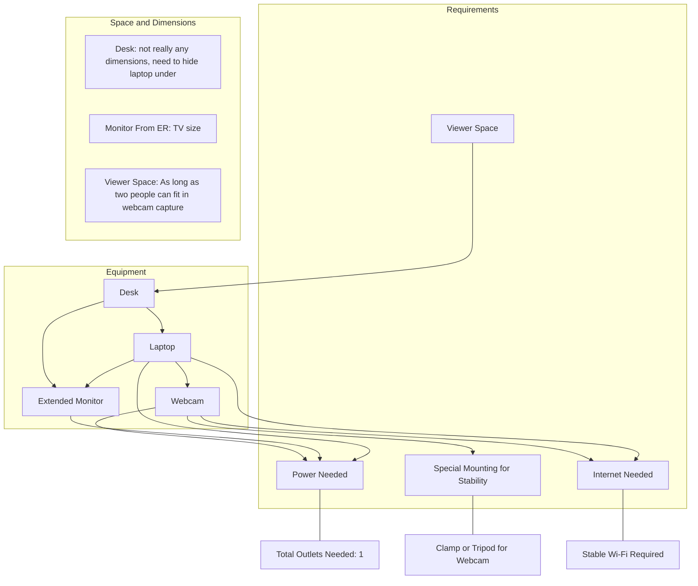

```mermaid
graph TB
  subgraph Equipment
    A[Laptop] --> B[Extended Monitor]
    A --> C[Webcam]
    D[Desk] --> B
    D --> A
  end

  subgraph Requirements
    A --> E[Power Needed]
    B --> E
    C --> E
    A --> F[Internet Needed]
    C --> F
    C --> G[Special Mounting for Stability]
    H[Viewer Space] --> D
  end

  subgraph Space and Dimensions
    DeskSize[Desk: not really any dimensions, need to hide laptop under]
    MonitorSize[Monitor From ER: TV size]
    ViewerSpace[Viewer Space: As long as two people can fit in webcam capture]
  end

  E --- Power[Total Outlets Needed: 1]
  F --- Wifi[Stable Wi-Fi Required]
  G --- ClampMount[Clamp or Tripod for Webcam]
```